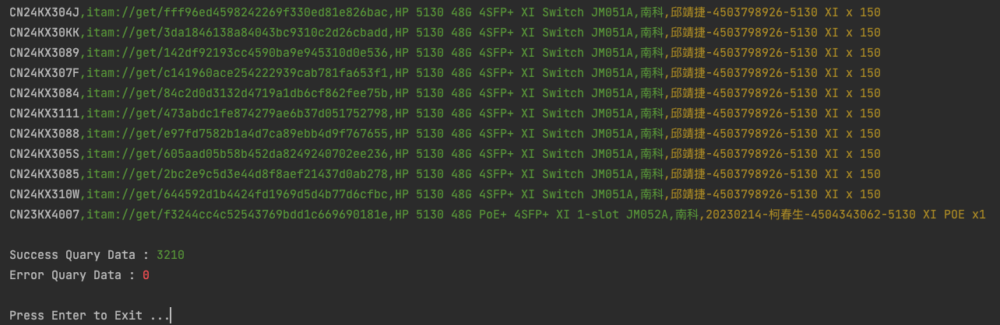

# AutoQuery-Model-via-KB-DB 

# 搜尋 DataBase 中特定的機型序號等資訊。
## 此程式可實現
  - 即時連線至 KB-DataBase 做 Model 比對。
  - Code 預設是找5130 XI，在第 24 行位置，有需要可自行修改。
  - DB 密碼已經先遮蔽掉，有需要請去詢問管理員。

## Logs
   * Version v1
     - 初版開發完成。

## Example :
此範例，完整在ITAM之中找出3210筆資料。

## Useage
    #Init for Virtual Env 建立虛擬環境。
    virtualenv venv
    
    #Active Virtual Env 進入虛擬環境。
    source ./venv/bin/activate
    
    #Install Requirements 安裝所需要之套件。
    pip install -r requirements.txt
    
    #Use it 準備就緒，可以直接執行，看看結果再行調整。
    python ./main.py
    
    or （如果想要打包為單一執行檔，下面就是打包的指令。）
    pyinstaller -F ./main.py -n ./AutoQuery-Model-via-KB-DB -i ico.ico
    
    #運作結束後，離開虛擬環境。
    deactivate
